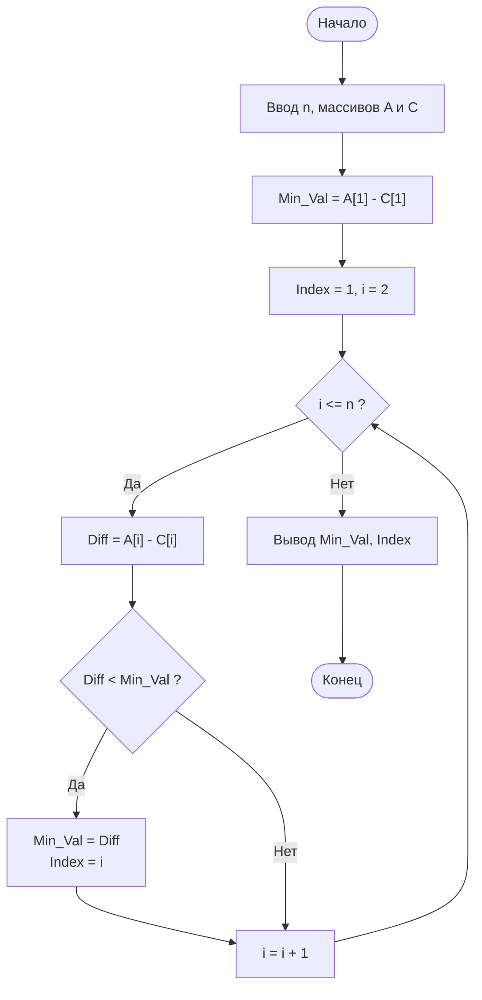

# Входные данные
| Параметр | ТИп | Описание | 
| ------------- | ------------- | ------------- |
| n | целое число | Количество элементов в массивах (n >= 1) |
| A[1..n] | Массив вещественных/целых чисел | Первый массив |
| C[1..n] | Массив вещественных/целых чисел | Второй массив |

# Выходные данные
| Параметр | ТИп | Описание | 
| ------------- | ------------- | ------------- |
| min_diff | вещественное/целое число | Наименьшее значение Ai − Ci |
| index | целое число | Порядковый номер элемента, для которого разность минимальна (1-based) |
